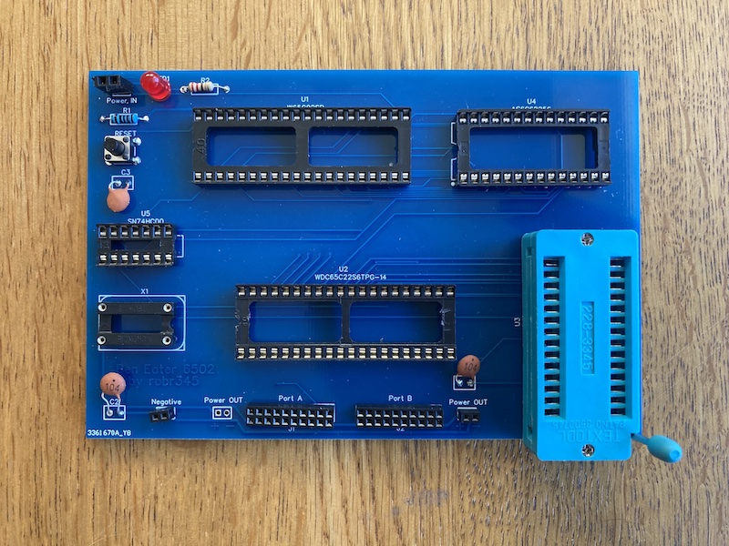

# Ben-Eater-6502
<b>No frills Ben Eater 6502 PCB</b> 

You can order 5 pcb's from EasyEDA or PCBWay for about £10, delivery takes about 2 weeks. The big advantage of using a PCB is relialibilty, if you have followed along with the videos you will know how easy it is to make mistakes and also very easy to have problems because a wire gets displaced.

This PCB only requires a few extra components.

2 40 pin IC Sockets

2 28 pin IC Sockets or

1 28 pin IC Socket and 1 28 pin ZIF socket

1 4 pin Mckenzie socket for the crystal

2 10 x 2 connector strip 2.0mm pitch

4 2 connector strip 2.0mm pitch

4 100nf ceramic capacitors

1 220ohm resistor

1 1k resistor

1 LED

1 Button Switch

